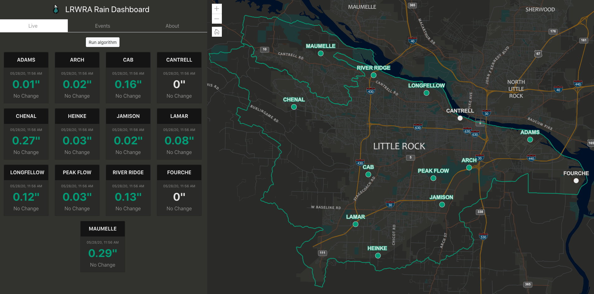

Little Rock Water Reclamation Authority Rain Dashboard application.  Created with React, Bootstrap, and ArcGIS API for JavaScript 4.15.

LIVE
The Live component displays accumulated rain amounts for each rain gauge.  Rain amounts and gauge location symbol on the map are synced so white = no rain and green = measured rain. Data is updated every 2 minutes.

Future capabilities for Live component will include charts for each gauge and "Check Rain Curve" button that will run algorithm to determine if current rain event exceeds the threshold for 2 year storm event.

EVENTS
The Events component will allow users to query past rain events or browse current years events. Clicking on an event will display charts for the gauges and allow the user to view time series/animation of the event with corresponding symbolization on the map.

